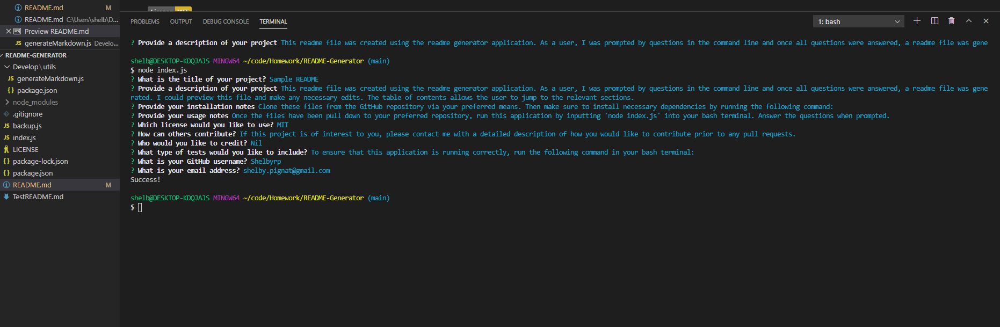
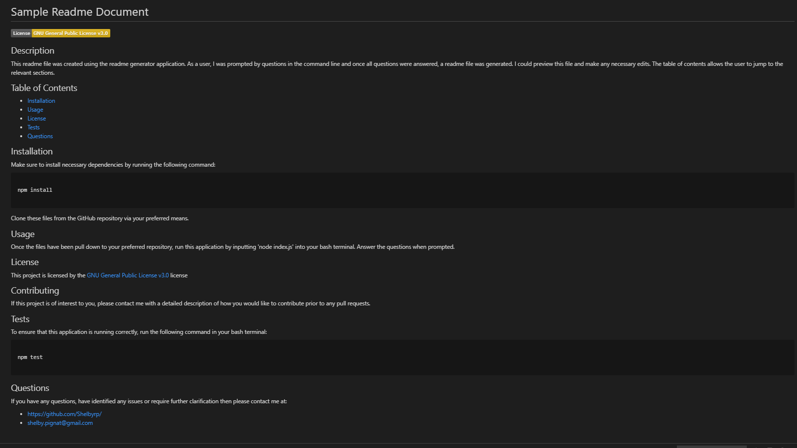

  # Sample README Generator

  [](https://opensource.org/licenses/MIT)

  ## Description
  This application was created as it’s important to have a high-quality README for any open source project on GitHub. Each of the projects should have a readme file to describe the application, how it is built, if others did contribute or can contribute, information about the license and credit to any resources used.

  The benefit of having this application is that you will save time writing the readme file, there is consistency and you will not miss any crucial information. The user is simply prompted to answer questions in the command line and then once every question is answered, the readme file is generated.

  To create this application, the Inquirer package was used. JavaScript has been utilised to create the program also.

  Here is a link to a demo video with a detailed description of how to use this application: [demo video](https://youtu.be/VzmHMKuU32I)

  ## Table of Contents
  - [Installation](#installation)
  - [Usage](#usage)
  - [License](#license)
  - [Contributing](#contributing)
  - [Credits](#credits)
  - [Tests](#tests)
  - [Questions](#questions)

  ## Installation 
  Clone these files from the GitHub repository via your preferred means. Then make sure to install necessary dependencies by running the following command:
  ```

  npm install

  ```
  ## Usage
  Once the files have been pull down to your preferred repository, run this application by inputting 'node index.js' into your bash terminal. Answer the questions when prompted.

  
  

  ## License
  This project is licensed by the [MIT](https://opensource.org/licenses/MIT) license

  ## Contributing 
  If this project is of interest to you, please contact me with a detailed description of how you would like to contribute prior to any pull requests.

  ## Credits
  https://www.npmjs.com/package/inquirer
  https://coding-boot-camp.github.io/full-stack/github/professional-readme-guide
  https://nodejs.org/api/fs.html

  ## Tests 
  To ensure that this application is running correctly, run the following command in your bash terminal:

  ```

  npm test

  ```

  ## Questions
  If you have any questions or require further clarification then please contact me at:
  - https://github.com/Shelbyrp/
  - shelby.pignat@gmail.com
